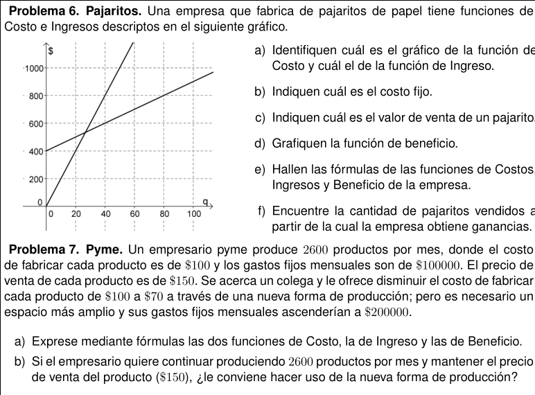

# Cursada

<!---


--->

## Semana 7 (Ma 19/May y Vie 22/May)

Hoja de ruta para esta semana (es decir actividades y tareas):

### Clase Vie 22/May

* Actividades: 
    - Desde 18hs.: encuentro virtual para consultas.
        - Pueden preguntar cualquier cosa que necesiten.
        - Por Google Meet: desde compu solamente hace falta una cuenta de gmail, no hay que instalar nada. Desde celu hay un app.
        - Un rato antes les paso el link del encuentro.

    - Luego vamos a trabajar a última parte de la [Unidad 3a](assets/pdf/Unidad3a.pdf) (problemas 42 en adelante)
        - se los vamos pasando por Telegram.
        - vamos viendo dudas, y van compartiendo y preguntando lo que necesiten.
        - **Muy importante** que intentes pensar los problemas, leyendo atentamente el enunciado, y construyendo de a poco.

* Tareas:
    - Hay bastante material, en el campus y en el canal de youtube, para que mires si querés reforzar.
    - Intentá terminar [Unidad 3a](assets/pdf/Unidad3a.pdf)
        - También hay problemas adicionales.
    - Andá publicando tus dudas en los canales de comunicación que prefieras (foro campus, Telegram, mail).
    - En el campus hay bibliografía también para que consultes. Si podés hacelo, siempre aporta mucho.

### Clase Ma 19/May

* Actividades: 
    - De 18 a 19 hs.: encuentro virtual para consultas.
        - Pueden preguntar cualquier cosa que necesiten.
        - Por Google Meet: desde compu solamente hace falta una cuenta de gmail, no hay que instalar nada. Desde celu hay un app.
        - Un rato antes les paso el link del encuentro.

    - De 19 a 22 hs.: vamos a trabajar los problemas 38 a 41 inclusive de la [Unidad 3a](assets/pdf/Unidad3a.pdf)
        - se los vamos pasando por Telegram.
        - vamos viendo dudas, y van compartiendo y preguntando lo que necesiten.
        - **Muy importante** que intentes pensar los problemas, leyendo atentamente el enunciado, y construyendo de a poco.

* Tareas:
    - Hay bastante material, en el campus y en el canal de youtube, para que mires si querés reforzar.
    - Intentá resolver hasta el problema 41 inclusive de la  [Unidad 3a](assets/pdf/Unidad3a.pdf)
    - Andá publicando tus dudas en los canales de comunicación que prefieras (foro campus, Telegram, mail).
    - En el campus hay bibliografía también para que consultes. Si podés hacelo, siempre aporta mucho.

---

## Semana 6 (Ma 12/May y Vie 15/May)

Hoja de ruta para esta semana (es decir actividades y tareas):

### Clase Vie 15/May

* Actividades: 
    - De 18 a 19 hs.: encuentro virtual para cerrar el comienzo de la unidad 3a de la clase pasada.
        - Jitsi la otra vez anduvo mal, así que esta la hacemos por Google Meet.
            - Google Meet: desde compu solamente hace falta una cuenta de gmail, no hay que instalar nada. Desde celu hay un app.
            - Un rato antes les paso el link del encuentro.

    - De 19 a 19.40 hs.: lagurar el problema 33 de la unidad 3a.
    - De 19.40 a 20 hs.: recreo.
    - De 20 a 22 hs.: elige tu propia aventura con estas dos opciones:
        - opción 1) seguir lagurando la unidad 3a, con los problemas 35, 36 y 37
        - opción 2) encuentro virtual para dudas de las unidades 1 y 2 (un rato antes pasamos link).        

* Tareas:
    - Hay bastante material, en el campus y en el canal de youtube, para que mires si querés reforzar.
    - Intentá resolver hasta el problema 37 inclusive de la  [Unidad 3a](assets/pdf/Unidad3a.pdf)
    - Andá publicando tus dudas en los canales de comunicación que prefieras (foro campus, Telegram, mail).
    - En el campus hay bibliografía también para que consultes. Si podés hacelo, siempre aporta mucho.

### Clase Ma 12/May

* Actividades: comenzamos con la [Unidad 3a](assets/pdf/Unidad3a.pdf) de modelos cuadráticos.
    - Leé **detenidamente** el problema 30 de la [Unidad 3a](assets/pdf/Unidad3a.pdf).
        - Intentá resolverlo. Lo que salga y como salga. No es necesario hacer todo.
        - Miré este [video](https://www.youtube.com/watch?v=9rOZR5Jpk9U).
            - **Importante:** tomá notas.
        - Terminá de resolver el problema 30.
            - Como siempre, nos vas mostrando cómo te va saliendo, consultas, dudas, o lo que quieras compartir por Telegram.
    - Leé **detenidamente** el problema 31 de la [Unidad 3a](assets/pdf/Unidad3a.pdf).
        - Intentá resolverlo.
        - Como siempre, nos vas mostrando cómo te va saliendo, consultas, dudas, o lo que quieras compartir por Telegram.
    - Mirá este [video](https://www.youtube.com/watch?v=S4Yb1Pa4KBw) sobre teoría de las cuadráticas.
        - **Importante:** tomá notas.
    - Leé **detenidamente** el problema 32 de la [Unidad 3a](assets/pdf/Unidad3a.pdf).
        - Intentá resolverlo.
        - Como siempre, nos vas mostrando cómo te va saliendo, consultas, dudas, o lo que quieras compartir por Telegram.
        
* Tareas:
    - Mirá estos dos videos más sobre cuadráticas:
        - [Video cuadrática parte 1](http://campusvirtual.unm.edu.ar/moodle/mod/url/view.php?id=19301)
        - [Video cuadrática parte 2](http://campusvirtual.unm.edu.ar/moodle/mod/url/view.php?id=19302)
    - Mirá este video para parábola con GeoGebra:
        - [Parábola GeoGebra](https://www.youtube.com/watch?v=T0nK8PHyJ-E)
    - Intentá resolver hasta el problema 33 inclusive de la  [Unidad 3a](assets/pdf/Unidad3a.pdf)
    - Andá publicando tus dudas en los canales de comunicación que prefieras (foro campus, Telegram, mail).
    - En el campus hay bibliografía también para que consultes. Si podés hacelo, siempre aporta mucho.

---

## Semana 5 (Ma 05/May y Vie 08/May)

Hoja de ruta para esta semana (es decir actividades y tareas):

### Clase Vie 08/May

* Actividades
    - Vamos a trabajar los últimos problemas de la  [Unidad 2](assets/pdf/Unidad2.pdf).
    - También vamos a contestar cualquier consulta de las unidades 1 y 2.
        
* Tareas:
    - Terminar la [Unidad 2](assets/pdf/Unidad2.pdf)
        - También tiene ejercicios adicionales.
    - **Evaluación/Cuestionario de las Unidades 1 y 2**:
        - Está en el campus.
        - **Ojo**: tenés 3 horas a partir de que lo empezás a hacer.

### Clase Ma 05/May

* Actividades
    - Releé **detenidamente** el enunciado del problema 26 de la [Unidad 2](assets/pdf/Unidad2.pdf).
        - Ahora intentá los ítems a) y b) de ese problema.
        - Ahora intentá el ítem c) con los sistemas de ecuaciones de ejercicio 19 de la [Unidad 2](assets/pdf/Unidad2.pdf)

    - Vamos a trabajar algunos problemas adicionales de la  [Unidad 2](assets/pdf/Unidad2.pdf).
        - Se darán problemas por Telegram para pensar e ir resolviendo ayudándose entre todxs.
        - **Muy importante** intentar pensar estos problemas. Es la única forma de ir progresando.
        - La idea es seguir usando los mini grupitos de Telegram para facilitar el intercambio.
        
* Tareas:
    - Terminá el problema 26 de la [Unidad 2](assets/pdf/Unidad2.pdf)
    - Andá publicando tus dudas en los canales de comunicación que prefieras (foro, mail, Telegram).
    - Si podés, seguí avanzando hasta terminar la [Unidad 2](assets/pdf/Unidad2.pdf), problemas 27 a 29 inclusive.
        - Este [video](https://www.youtube.com/watch?v=FNaZ9SnITzQ) quizás te ayude. Miralo.

---

## Semana 4 (Ma 28/Abr. El Viernes es feriado)

Hoja de ruta para esta semana (es decir actividades y tareas):

### Clase Ma 28/Abr

* Actividades
    - De 18 a 18.30 hs., ver este [video introducción a sistemas de ecuaciones lineales (10 min.)](https://www.youtube.com/watch?v=nwy8UVGey0g)
        - El video dura 10 min. pero tenés 30 min. para mirarlo tranquilx, e ir entendiendo y tomando apuntes.
    - Encuentro virtual de 18:30 a 19.40 hs. para seguir introduciendo el tema.
    - De 19.40 a 20 hs. descanso.
    - De 20 a 22 hs. se darán problemas por Telegram para pensar e ir resolviendo ayudándose entre todxs.
        - **Muy importante** intentar pensar estos problemas. Es la única forma de ir progresando.
        - La idea es seguir usando los mini grupitos de Telegram para facilitar el intercambio.
        
* Tareas:
    - Intentá los problemas 19 a 25 de la [Unidad 2](assets/pdf/Unidad2.pdf)
    - Andá publicando tus dudas en los canales de comunicación que prefieras (foro, mail, Telegram).
    - Leer el enunciado del problema 26 de la [Unidad 2](assets/pdf/Unidad2.pdf)

---
## Semana 3 (Ma 21/Abr y Vie 24/Abr)

Hoja de ruta para esta semana (es decir actividades y tareas):

### Clase Vie 24/Abr

* Actividades
    - Unirse a alguno de estos mini grupos de Telegram:
        - **Importante:** si te unís a un grupo y ya hay más de 10 personas, unite a otro por favor. La idea es trabajar en grupitos reducidos, para facilitar el intercambio.
        - [Grupo 1](https://t.me/joinchat/Esdo1hkWv3hL4FLjuDgriA)
        - [Grupo 2](https://t.me/joinchat/Esdo1h0HjN84UcLZYV3wqA)
        - [Grupo 3](https://t.me/joinchat/Esdo1hknJCtHZ_9DUjMVjg)
        - [Grupo 4](https://t.me/joinchat/Esdo1hYCKcHJW1kMazGQmQ)
        - [Grupo 5](https://t.me/joinchat/Esdo1hQYNKsXlcQ5MvFN1A)
        - [Grupo 6](https://t.me/joinchat/Esdo1hj9p4X25ssPot0ioQ)

    - De 18 a 21 hs.
        - Van a pensar algunos problemas que les digamos. Los pasamos por el [canal de Telegram](https://t.me/joinchat/AAAAAEwprmdz2LDYlfp2Qg).
        - Es **muy importante** que aprovechen el tiempo de clase para ponerse a pensar e intentar los problemas que vamos a proponer.
        - La idea es que los vayan pensando y resolviendo, y se vayan ayudando y compartiendo dudas y resoluciones por los mini grupitos de Telegram.
        - Nosotros, por el [canal de Telegram](https://t.me/joinchat/AAAAAEwprmdz2LDYlfp2Qg), iremos tirando guías, conceptos importantes, y pequeñas preguntas para pensar de a poquito.
    
    - De 21 a 22 hs.
        - Por los mini grupitos de Telegram, consultas sobre lo que necesiten.        

* Tareas:
    - Terminar la [Unidad 1](assets/pdf/unidad1_modelosLineales.pdf)
    - También hay ejercicios adicionales para esta unidad.
    - Andá publicando tus dudas en los canales de comunicación que prefieras (foro, mail, Telegram).

### Clase Ma 21/Abr

* Actividades
    - De 18 a 22 hs.
        - Van a pensar 2 problemas que les digamos. Los pasamos por el [canal de Telegram](https://t.me/joinchat/AAAAAEwprmdz2LDYlfp2Qg).
        - Es **muy importante** que aprovechen el tiempo de clase para ponerse a pensar e intentar los problemas que vamos a proponer.
        - La idea es que los vayan pensando y resolviendo, y se vayan ayudando y compartiendo dudas y resoluciones por el grupo de Telegram (o por cualquier grupo que tengan).
        - Nosotros, por el [canal de Telegram](https://t.me/joinchat/AAAAAEwprmdz2LDYlfp2Qg), iremos tirando guías, conceptos importantes, y pequeñas preguntas para pensar de a poquito. Además también iremos respondiendo dudas por el [grupo Telegram](https://t.me/joinchat/Esdo1kj7LXJw_oQFD6LWjA).

* Tareas:
    - Intentá hacer los problemas 15 a 17 inclusive de la [Unidad 1](assets/pdf/unidad1_modelosLineales.pdf)
    - Andá publicando tus dudas en los canales de comunicación que prefieras (foro, mail, Telegram).

* **Tarea para entregar:** para el Vie 24/Abr hasta última hora (o antes)
    - Entregar [este problema](https://drive.google.com/open?id=1WkEuYa_A-uRXO3QjFjP3c_WNn0LfsIbf) (si no entregaron los de la clase pasada, no importa).
    - Lxs que no pudieron entregar los ejercicios de la clase pasada, también pueden entregar esos ejercicios si quieren.

---

## Semana 2 (Ma 14/Abr y Vie 17/Abr)

Hoja de ruta para esta semana (es decir actividades y tareas):

### Clase Vie 17/Abr

* Actividades
    - Encuentros virtuales 18 hs. y 20 hs.
        - Para puesta en común y consultas sobre la tarea de la clase pasada (o de antes, no hay problema).
        - Por Telegram y mail, anunciamos un rato antes por dónde.

* Tarea en base a consultas clase pasada:
    - Mirá este [video problema tornillos unidad 1 (parte 1, 10 min.)](https://youtu.be/W-EYoTvE8TE)
    - Mirá este [video problema tornillos unidad 1 (parte 2, 5 min.)](https://youtu.be/hkF-EOCEXUk)

* Tareas:
    - Mirá este [video de un problema unidad 1 (11 min.)](https://www.youtube.com/watch?v=m4d9zT3HyH8)
    - Mirá este [video GeoGebra parte 1 (3 min.)](https://www.youtube.com/watch?v=xx1u4LcSav4)
    - Mirá este [video GeoGebra parte 2 (3 min.)](https://www.youtube.com/watch?v=TkR9ANdC2HU)
    - Mirá este [video mismo problema de antes pero en GeoGebra (4 min.)](https://www.youtube.com/watch?v=pGcFype1o5M)
    - Intentá hacer los problemas 11 a 14 inclusive de la [Unidad 1](assets/pdf/unidad1_modelosLineales.pdf)
    - Andá publicando tus dudas en el [foro](foro) o en el [grupo Telegram com 12](https://t.me/joinchat/Esdo1kj7LXJw_oQFD6LWjA) 

* **Tarea para entregar, para el Martes 21/Abr (o antes)** (Después decimos bien cómo, pero igual se puede ir haciendo)
    - Estos dos problemas:  
    - _Opcionalmente_, es decir si querés, también podés entregar [este problema](https://drive.google.com/open?id=1WkEuYa_A-uRXO3QjFjP3c_WNn0LfsIbf)

### Clase Ma 14/Abr

* Actividades
    - Encuentros virtuales para consultas. Anotarse [en esta encuesta](https://doodle.com/poll/q8d7hnfye7rp89di)
        - Hay que poner el nombre y elegir una opción.
        - Ante cualquier inconveniente, sientansé libres de unirse a cualquiera.
        - Vamos a pasar los links de las salas mañana por Telegram.
    - Unirse al grupo de Telegram (es distinto del canal): [grupo Telegram com 12](https://t.me/joinchat/Esdo1kj7LXJw_oQFD6LWjA)

* Tareas:
    - Repasá el problema 6 de la [Unidad 1](assets/pdf/unidad1_modelosLineales.pdf)
    - Mirá este [video de función lineal episodio I](https://www.youtube.com/watch?v=6ZRu6wg2XDg)
    - Mirá este [video de función lineal episodio II](https://www.youtube.com/watch?v=3gkEtPRSoug)
    - Mirá este [video de cómo graficar una función lineal](https://www.youtube.com/watch?v=43K6jX6r9nM)
    - Intentá hacer los problemas 8 a 10 inclusive de la [Unidad 1](assets/pdf/unidad1_modelosLineales.pdf)
    - Andá publicando tus dudas en el [foro](foro) o en el [grupo Telegram com 12](https://t.me/joinchat/Esdo1kj7LXJw_oQFD6LWjA) 

<!---
    - Mirá este [video función lineal parte 1](https://www.youtube.com/watch?v=Cp9c5HXxIZA)
    - Mirá este [video función lineal parte 2](https://www.youtube.com/watch?v=mHetw7oH_eA)
--->

---

## Semana 1 (Ma 07/Abr. El Viernes es feriado)
<!---
* Completar la [encuesta de relevamiento tecnológico](https://docs.google.com/forms/d/1WjBEGgg_rBTDGzfZb5j-YZBPIMxuRVcKOlCDaoc9XeQ/)
--->

### Encuentro virtual por grupos
Vamos a (intentar) hacer un mini encuentro virtual por grupos, como para vernos las caras y conocernos un poco, según este [cronograma](cronograma). Ahí también están las salas para los encuentros.

Si vas a usar compu, en principio no necesitás instalarte nada. 

Si vas a usar celu, te tenés que instalar [jitsi](https://jitsi.org/downloads/). Se usa para video conferencias.

Si vas a usar compu, sería genial si tenés micrófono (lo usás con los auriculares del celu). Si lo podés probar antes, sería ideal.

Además, como plan B, también sería genial si ya podés ir instalándote [zoom](https://zoom.us/download). También se usa para video conferencias, y está para compu y para celu. Acá hay una [guía](assets/tutoriales/tutorial_zoom.pdf) que te puede ayudar a instalarlo.

### Hoja de ruta para esta semana
Estas son las actividades programadas para esta semana:

* Leé estas [recomendaciones](recomendaciones) para la cursada.

* Hacé la [prueba diagnóstico](https://docs.google.com/forms/d/1lsNd1Ny_ApRA73p3TlivCEAc2Dlu2OO--jcgORhfnds/) (esto debería ser un repaso del COPRUN, pero si encontrás dificultades y querés practicar más, podés hacer la [Unidad 0](assets/pdf/unidad0_repasoAlgebraico.pdf) de la guía de ejercicios).

* Mirá este [video función costo](https://youtu.be/g1301gSGlBE) (el autor es un compa nuestro)

* Mirá este [resuelto función costo](assets/cursada/unidad1/Problema_1_Mesas.pdf) (el autor es un compa nuestro)

* Mirá este [video función ingreso](https://youtu.be/YRE3vyBoruQ) (el autor es un compa nuestro)

* Mirá este [video función beneficio](https://youtu.be/oCfqQQytztU) (el autor es un compa nuestro)

* Intentá hacer los ejercicio 1 a 7 inclusive de la [Unidad 1](assets/pdf/unidad1_modelosLineales.pdf)

* Andá publicando tus dudas en el [foro](foro)

* Material complementario recomendado: mirar la unidad 1 de [material](material). Allí hay más videos, resueltos y bibliografía.
